# 🧭 Embedded Systems Engineer — Complete Career Roadmap

> **From Trainee to Global Systems Architect**
> A comprehensive visual guide with 20+ Mermaid diagrams

---

## 📄 Page 1 — Career Growth Path (Big Picture)

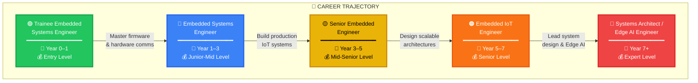

---

## 📄 Page 2 — Industry Sectors Overview

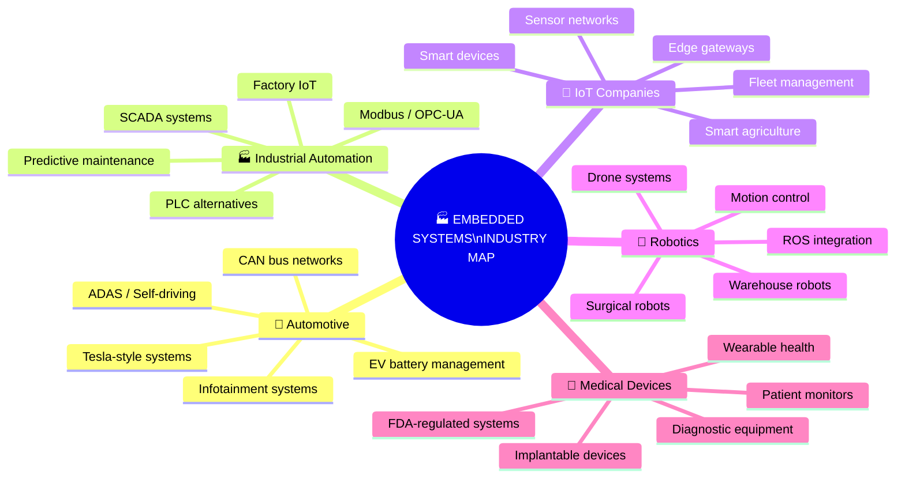

---

## 📄 Page 3 — Phase 1 Skill Map (0–6 Months)

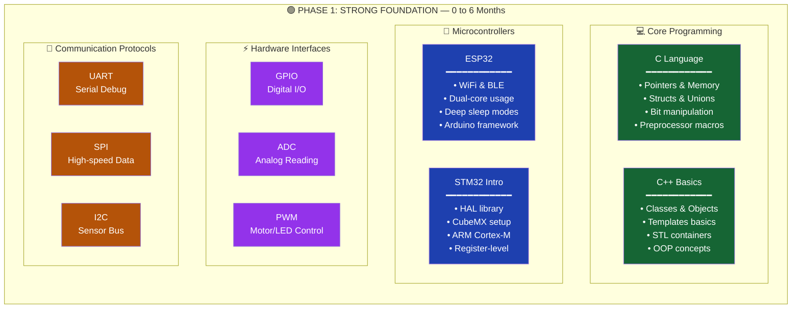

---

## 📄 Page 4 — Phase 1 Tools & Goal

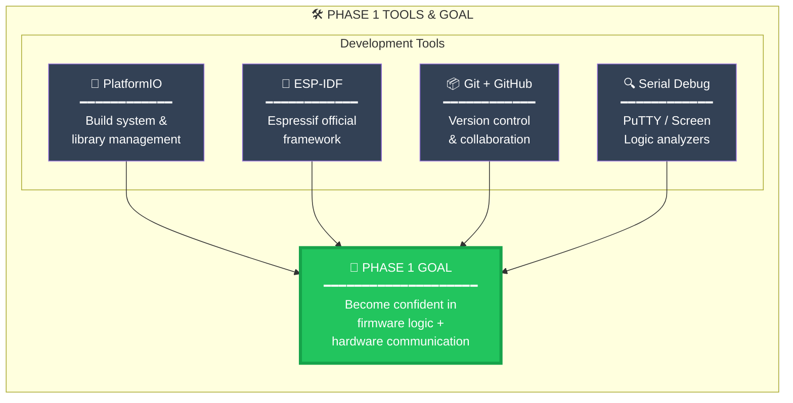

---

## 📄 Page 5 — Phase 2 Skill Map (6–18 Months)

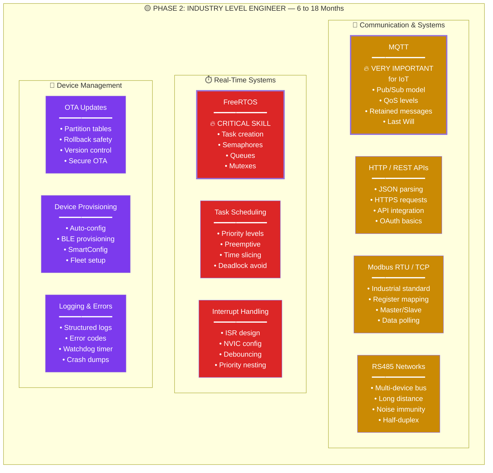

---

## 📄 Page 6 — Phase 2 Goal & Deliverables

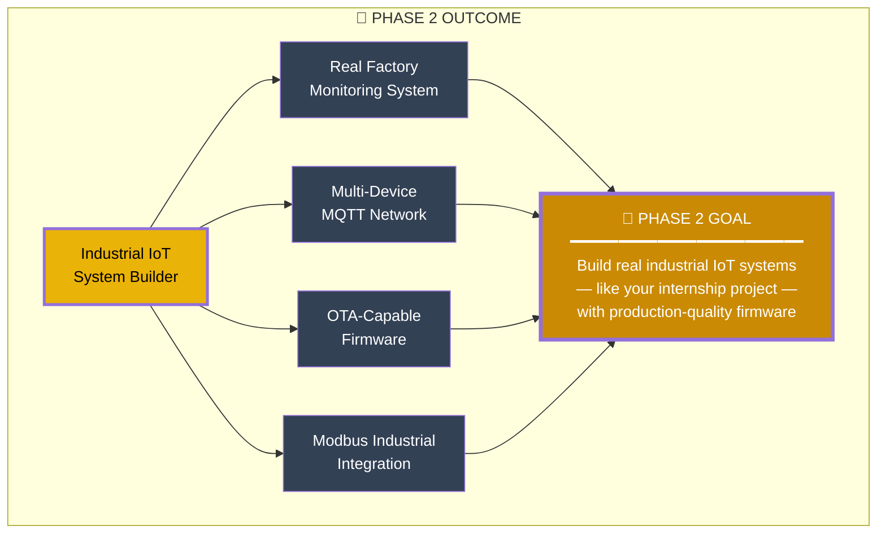

---

## 📄 Page 7 — Phase 3 Skill Map (18–36 Months)

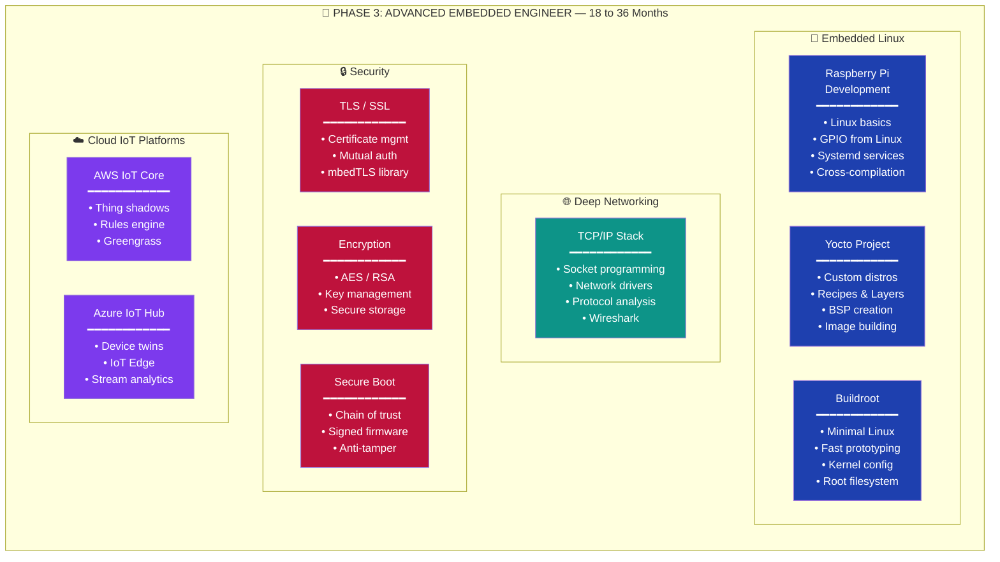

---

## 📄 Page 8 — Phase 3 Goal

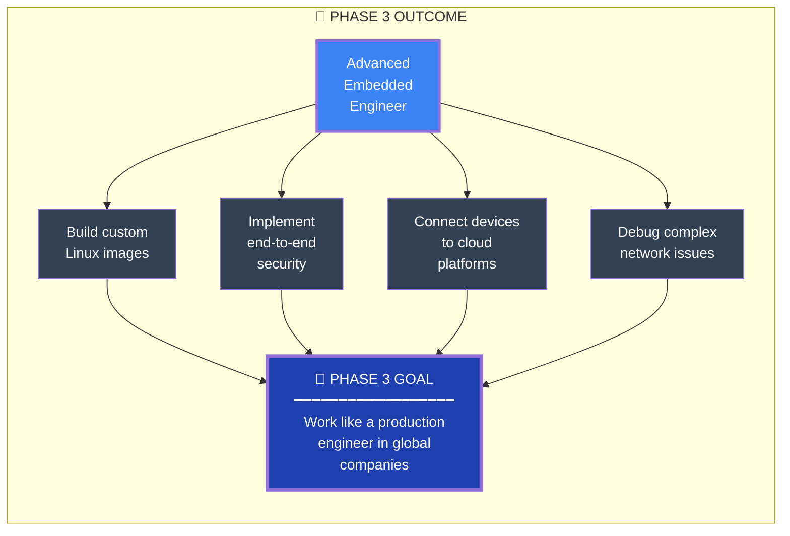

---

## 📄 Page 9 — Phase 4 Elite Skills (3–5 Years)

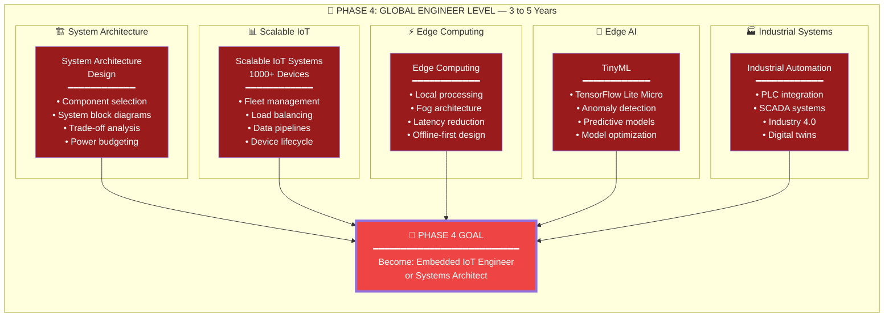

---

## 📄 Page 10 — Complete Phase Timeline

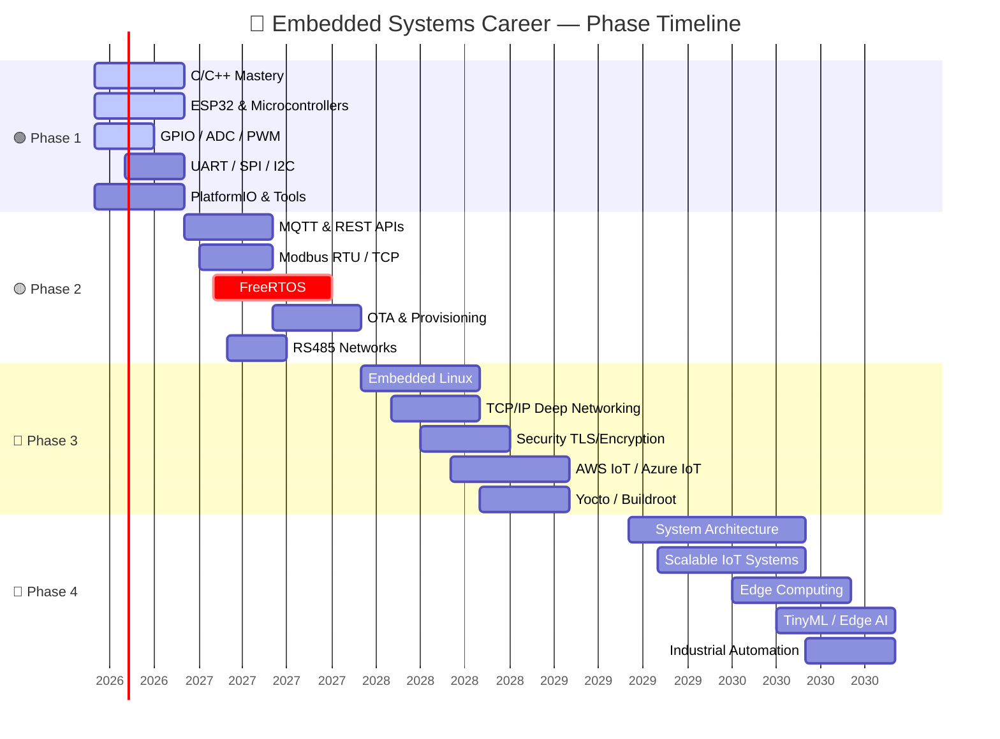

---

## 📄 Page 11 — Sri Lanka Salary Progression

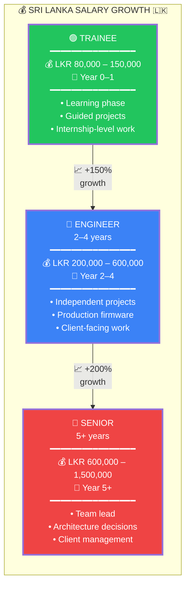

---

## 📄 Page 12 — Global Salary Comparison

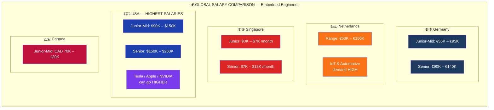

---

## 📄 Page 13 — Best Countries for Embedded Jobs

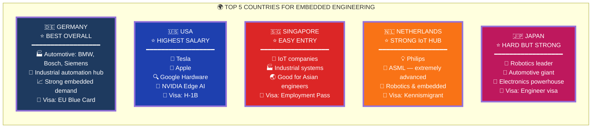

---

## 📄 Page 14 — Germany Deep Dive

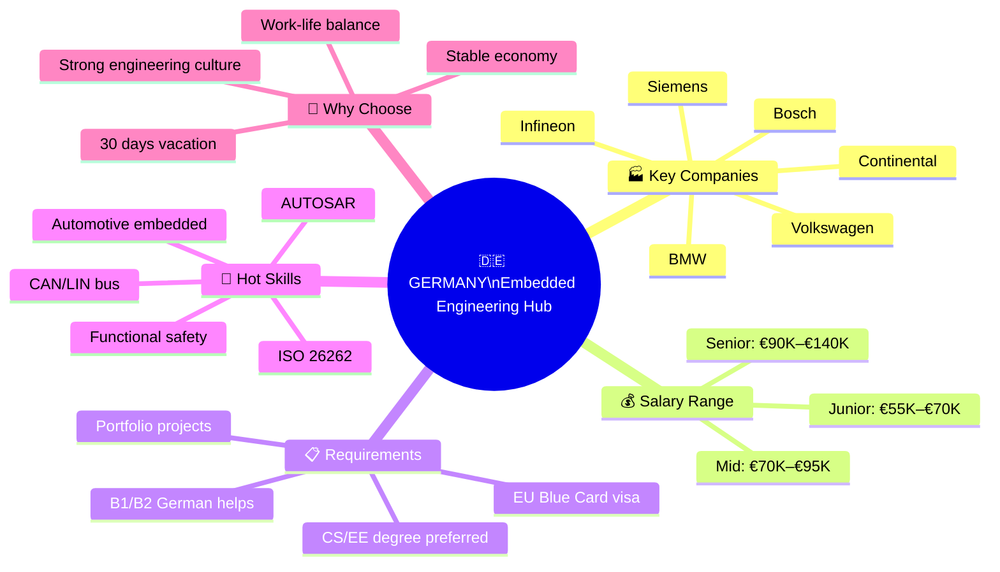

---

## 📄 Page 15 — USA Deep Dive

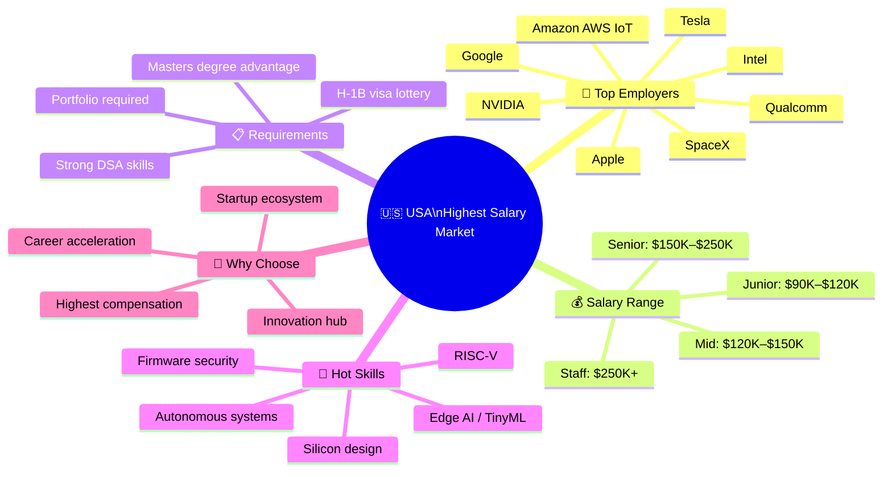

---

## 📄 Page 16 — Companies by Sector

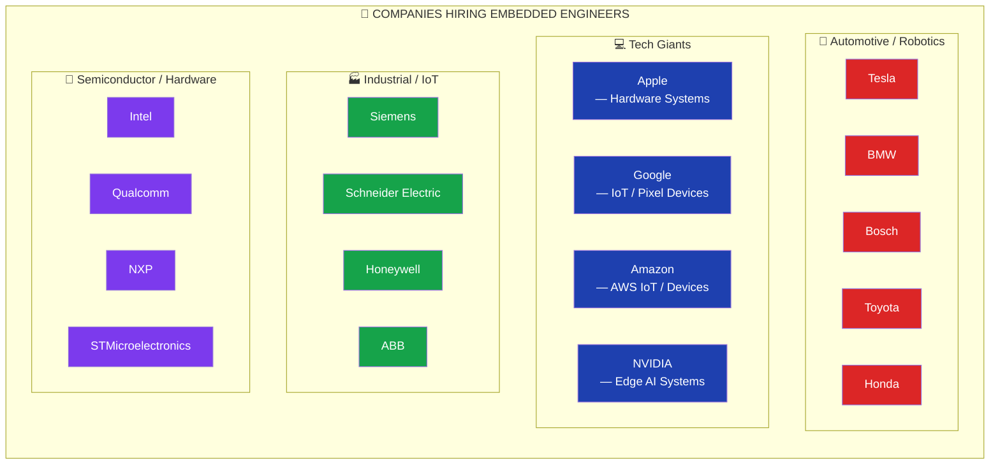

---

## 📄 Page 17 — 5-Year Strategy Timeline

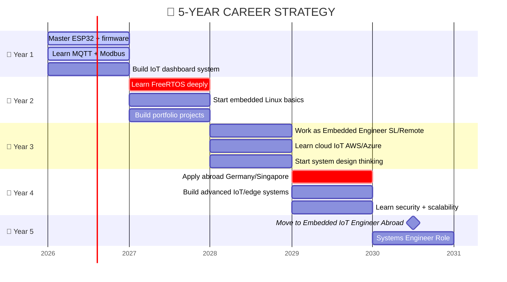

---

## 📄 Page 18 — Year-by-Year Strategy Details

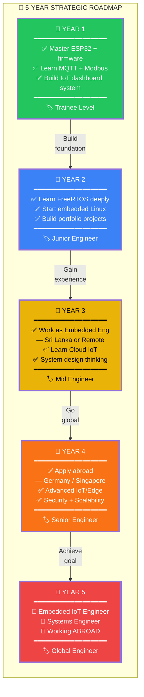

---

## 📄 Page 19 — What Makes High Salary Engineers

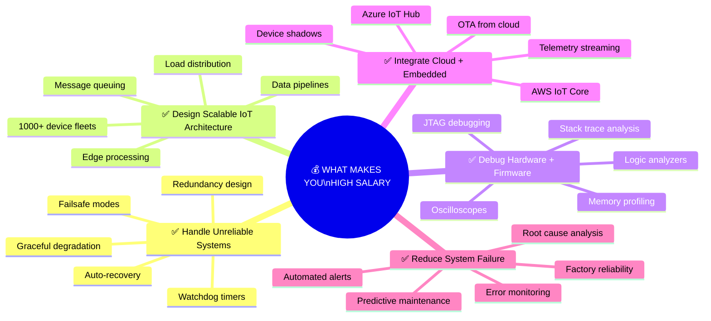

---

## 📄 Page 20 — Your Unique Advantage

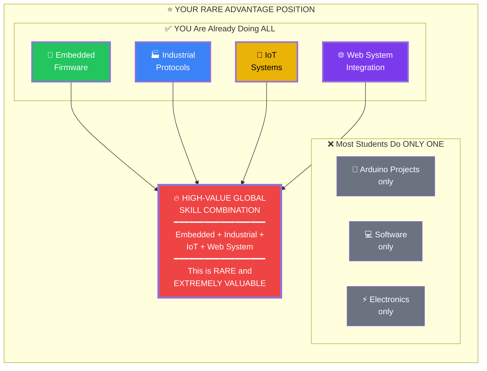

---

## 📄 Page 21 — Technology Stack Dependencies

```mermaid
graph BT
    subgraph "🔧 EMBEDDED TECHNOLOGY STACK — Bottom to Top"
        direction BT

        HW["⚡ HARDWARE LAYER\n━━━━━━━━━━━━━━━━━━━━━━━━\nMCU / SoC / Sensors / Actuators\nESP32 • STM32 • nRF52 • RISC-V"]

        DRV["🔌 DRIVER LAYER\n━━━━━━━━━━━━━━━━━━━━━━━━\nGPIO • ADC • PWM • UART • SPI • I2C\nDMA • Timers • Interrupts"]

        RTOS["⏱️ RTOS LAYER\n━━━━━━━━━━━━━━━━━━━━━━━━\nFreeRTOS • Zephyr • ThreadX\nTask Management • Scheduling"]

        PROTO["📡 PROTOCOL LAYER\n━━━━━━━━━━━━━━━━━━━━━━━━\nMQTT • HTTP • Modbus • CoAP\nBLE • WiFi • LoRa • Zigbee"]

        APP["📱 APPLICATION LAYER\n━━━━━━━━━━━━━━━━━━━━━━━━\nBusiness Logic • State Machines\nOTA • Provisioning • Logging"]

        CLOUD["☁️ CLOUD LAYER\n━━━━━━━━━━━━━━━━━━━━━━━━\nAWS IoT • Azure IoT • GCP IoT\nDashboards • Analytics • ML"]

        HW --> DRV
        DRV --> RTOS
        RTOS --> PROTO
        PROTO --> APP
        APP --> CLOUD
    end

    style HW fill:#334155,color:#fff,stroke-width:3px
    style DRV fill:#1e40af,color:#fff,stroke-width:3px
    style RTOS fill:#dc2626,color:#fff,stroke-width:3px
    style PROTO fill:#ca8a04,color:#fff,stroke-width:3px
    style APP fill:#16a34a,color:#fff,stroke-width:3px
    style CLOUD fill:#7c3aed,color:#fff,stroke-width:3px
```

---

## 📄 Page 22 — IoT System Architecture (What You'll Build)

```mermaid
graph LR
    subgraph "📡 EDGE DEVICES"
        S1["🌡️ Temp Sensor\nESP32 + DS18B20"]
        S2["💨 Air Quality\nESP32 + MQ135"]
        S3["⚡ Power Meter\nESP32 + PZEM"]
        S4["📏 Distance\nESP32 + VL53L0X"]
    end

    subgraph "🌐 GATEWAY"
        GW["🖥️ Edge Gateway\n━━━━━━━━━━━━\nRaspberry Pi\nMosquitto MQTT\nNode-RED\nLocal DB"]
    end

    subgraph "☁️ CLOUD"
        CLOUD_MQTT["📨 MQTT Broker\nAWS IoT Core"]
        CLOUD_DB["🗄️ Database\nTimestream/InfluxDB"]
        CLOUD_ML["🧠 ML Engine\nAnomaly Detection"]
    end

    subgraph "📊 DASHBOARD"
        DASH["📈 Web Dashboard\n━━━━━━━━━━━━\nReal-time charts\nAlerts & notifications\nDevice management\nOTA control"]
    end

    S1 -->|"MQTT"| GW
    S2 -->|"MQTT"| GW
    S3 -->|"Modbus"| GW
    S4 -->|"I2C"| GW
    GW -->|"TLS/MQTT"| CLOUD_MQTT
    CLOUD_MQTT --> CLOUD_DB
    CLOUD_DB --> CLOUD_ML
    CLOUD_DB --> DASH
    CLOUD_ML --> DASH

    style S1 fill:#22c55e,color:#fff
    style S2 fill:#22c55e,color:#fff
    style S3 fill:#22c55e,color:#fff
    style S4 fill:#22c55e,color:#fff
    style GW fill:#3b82f6,color:#fff,stroke-width:3px
    style CLOUD_MQTT fill:#7c3aed,color:#fff
    style CLOUD_DB fill:#7c3aed,color:#fff
    style CLOUD_ML fill:#7c3aed,color:#fff
    style DASH fill:#f97316,color:#fff,stroke-width:3px
```

---

## 📄 Page 23 — Certification & Learning Path

```mermaid
graph TD
    subgraph "📜 CERTIFICATIONS & LEARNING RESOURCES"
        direction TB

        subgraph "🎓 Online Courses"
            OC1["Udemy\n━━━━━━━━━━━━\n• Mastering MCU\n  with ESP32\n• FreeRTOS from\n  ground up"]
            OC2["Coursera\n━━━━━━━━━━━━\n• Embedded Systems\n  by U of Colorado\n• IoT Specialization"]
            OC3["edX\n━━━━━━━━━━━━\n• Embedded Systems\n  Shape the World\n  — UT Austin"]
        end

        subgraph "📜 Certifications"
            CERT1["AWS IoT\nCertification\n━━━━━━━━━━━━\nAWS Certified\nSpecialty"]
            CERT2["ARM Accredited\nEngineer\n━━━━━━━━━━━━\nCortex-M\nspecialization"]
            CERT3["ISTQB\nTesting\n━━━━━━━━━━━━\nEmbedded testing\nmethodology"]
        end

        subgraph "📚 Must-Read Books"
            B1["Making Embedded\nSystems\n— Elecia White"]
            B2["Programming\nEmbedded Systems\nin C and C++\n— Michael Barr"]
            B3["Mastering the\nFreeRTOS Kernel\n— Richard Barry"]
        end
    end

    style OC1 fill:#1e40af,color:#fff
    style OC2 fill:#1e40af,color:#fff
    style OC3 fill:#1e40af,color:#fff
    style CERT1 fill:#ca8a04,color:#fff
    style CERT2 fill:#ca8a04,color:#fff
    style CERT3 fill:#ca8a04,color:#fff
    style B1 fill:#16a34a,color:#fff
    style B2 fill:#16a34a,color:#fff
    style B3 fill:#16a34a,color:#fff
```

---

## 📄 Page 24 — Portfolio Project Ideas

```mermaid
mindmap
  root(("🛠️ PORTFOLIO\nPROJECT IDEAS"))
    🟢 Beginner Projects
      Smart Weather Station
        ESP32 + BME280
        MQTT to dashboard
        Battery powered
      Home Automation Hub
        Relay control
        App interface
        Scheduling
      Plant Monitoring System
        Soil moisture
        Auto watering
        Data logging
    🟡 Intermediate Projects
      Industrial Sensor Network
        RS485 + Modbus
        Multi-node mesh
        Alert system
      OTA Update System
        Dual partition
        Rollback safety
        Version tracking
      Fleet GPS Tracker
        SIM800L + GPS
        Real-time map
        Geofencing
    🔴 Advanced Projects
      Edge AI Anomaly Detector
        TinyML model
        Vibration analysis
        Predictive alerts
      Custom IoT Platform
        1000+ devices
        Cloud dashboard
        Fleet management
      Autonomous Robot
        Motor control
        Obstacle avoid
        Path planning
```

---

## 📄 Page 25 — Interview Preparation Map

```mermaid
graph TD
    subgraph "🎯 EMBEDDED INTERVIEW PREPARATION"
        direction TB

        subgraph "💻 Technical Topics"
            IT1["C/C++ Deep\n━━━━━━━━━━━━\n• Pointers\n• Memory layout\n• Volatile keyword\n• Bit manipulation\n• Struct packing"]
            IT2["RTOS Concepts\n━━━━━━━━━━━━\n• Priority inversion\n• Deadlock vs livelock\n• Semaphore vs mutex\n• Task states\n• Context switching"]
            IT3["Hardware Interfaces\n━━━━━━━━━━━━\n• I2C vs SPI timing\n• UART framing\n• DMA transfers\n• Interrupt latency\n• Clock trees"]
            IT4["System Design\n━━━━━━━━━━━━\n• Power optimization\n• Memory management\n• Watchdog strategies\n• Bootloader design\n• State machines"]
        end

        subgraph "🧪 Practical Tests"
            PT1["Whiteboard\nCoding\n━━━━━━━━━━━━\nLinked lists\nBit ops\nRing buffers"]
            PT2["Hardware\nDebugging\n━━━━━━━━━━━━\nOscilloscope use\nLogic analyzer\nSerial decode"]
            PT3["Take-Home\nProjects\n━━━━━━━━━━━━\nFirmware task\nDriver writing\nProtocol impl"]
        end
    end

    style IT1 fill:#1e40af,color:#fff
    style IT2 fill:#1e40af,color:#fff
    style IT3 fill:#1e40af,color:#fff
    style IT4 fill:#1e40af,color:#fff
    style PT1 fill:#dc2626,color:#fff
    style PT2 fill:#dc2626,color:#fff
    style PT3 fill:#dc2626,color:#fff
```

---

## 📄 Page 26 — Final Conclusion

```mermaid
graph TD
    subgraph "🏁 FINAL CONCLUSION"
        direction TB

        START["⭐ YOU ARE HERE\n━━━━━━━━━━━━━━━━━━━━━━━━\nTrainee Embedded\nSystems Engineer\n━━━━━━━━━━━━━━━━━━━━━━━━\nAlready doing:\nEmbedded + Industrial +\nIoT + Web System"]

        PATH["🛤️ YOUR PATH\n━━━━━━━━━━━━━━━━━━━━━━━━\nFollow the 4-phase roadmap\nBuild portfolio projects\nGain production experience\nLearn cloud + security"]

        DESTINATION["🌟 YOUR DESTINATION\n━━━━━━━━━━━━━━━━━━━━━━━━\nGlobal Embedded\nIoT Engineer\n━━━━━━━━━━━━━━━━━━━━━━━━\n🇩🇪 Germany • 🇺🇸 USA • 🇸🇬 Singapore\nHigh salary • Global career\nStrong demand • Edge AI frontier"]

        ADVANTAGE["🔥 YOUR ADVANTAGE\n━━━━━━━━━━━━━━━━━━━━━━━━\nYou are in a RARE position:\nReal industrial IoT experience\nas a trainee = HEAD START\nover 90% of graduates"]

        START -->|"3–5 years\nof focused\ngrowth"| PATH
        PATH --> DESTINATION
        ADVANTAGE -.->|"Leverage\nthis!"| PATH
    end

    style START fill:#22c55e,color:#fff,stroke-width:4px
    style PATH fill:#3b82f6,color:#fff,stroke-width:3px
    style DESTINATION fill:#ef4444,color:#fff,stroke-width:4px
    style ADVANTAGE fill:#eab308,color:#000,stroke-width:4px
```

---

> **🧭 Remember:** The embedded systems field has one of the **strongest long-term engineering tracks** in the world. Your path is correct. Stay focused, build real projects, and the global opportunities will come.

---

*Generated: May 2026 | Total: 26 Mermaid Diagram Pages*
